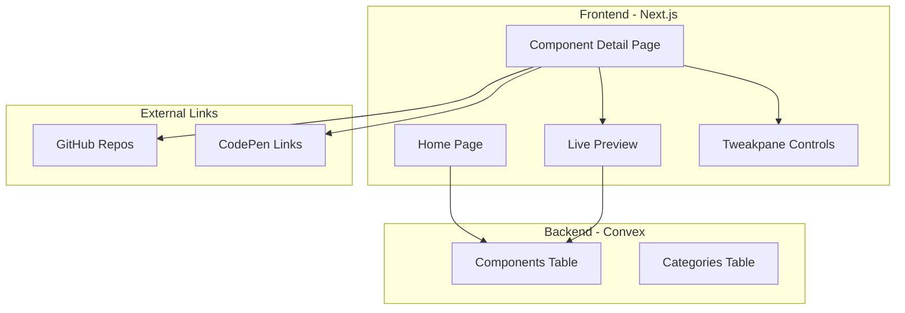

# StashCode Component Library

## Architecture Overview



## Data Model (Convex)

**Components Table:**

- `name`: string
- `description`: string
- `category`: string
- `previewImage`: string (URL)
- `reactCode`: string (optional)
- `vanillaCode`: object { html, css, js } (optional)
- `githubUrl`: string (optional)
- `codepenUrl`: string (optional)
- `tweakpaneConfig`: object (props that can be tweaked)
- `createdAt`: number

**Categories Table:**

- `name`: string
- `slug`: string

## Project Structure

```
app/
├── page.tsx                 # Homepage with component grid
├── components/[slug]/       # Component detail page
│   └── page.tsx
├── globals.css
├── layout.tsx
├── fonts/                   # Geist + Instrument Serif fonts
components/
├── ui/
│   ├── Header.tsx
│   ├── ComponentCard.tsx
│   ├── CodeBlock.tsx
│   └── Button.tsx
├── preview/
│   ├── ComponentPreview.tsx
│   └── TweakpanePanel.tsx
convex/
├── schema.ts
├── components.ts            # Component queries/mutations
└── categories.ts
public/
├── logo.svg                 # StashCode logo
```

## Key Implementation Details

1. **Homepage** ([app/page.tsx](app/page.tsx))

   - Dark theme (#0a0a0a background)
   - Header with logo + "Submit Idea" button
   - Hero section with Instrument Serif headline
   - Responsive component grid (3 columns on desktop)
   - Gradient fade overlay at bottom
   - "Browse more" red button (#9a2323)

2. **Fonts**

   - Geist (body text) - already included with Next.js
   - Geist Mono (code/buttons)
   - Instrument Serif (headlines) - needs to be added via Google Fonts

3. **Component Detail Page**

   - Live preview iframe/sandbox
   - Tweakpane panel for adjusting props
   - Code tabs (React / Vanilla HTML)
   - Copy code button
   - GitHub/CodePen external links

4. **Tweakpane Integration**

   - Install `tweakpane` npm package
   - Create wrapper component that reads config from Convex
   - Support number, string, boolean, color inputs
   - Real-time preview updates

5. **Convex Setup**

   - Define schema with components and categories
   - Create queries for listing/fetching components
   - Use Doppler environment variables for Convex credentials

## Design Tokens (from Figma)

| Token | Value |

|-------|-------|

| Background | #0a0a0a |

| Card BG | rgba(255,255,255,0.07) |

| Card Border | #424242 |

| Text Primary | #ffffff |

| Text Secondary | rgba(255,255,255,0.6) |

| Accent Red | #9a2323 |

| Button BG | #3c3540 |